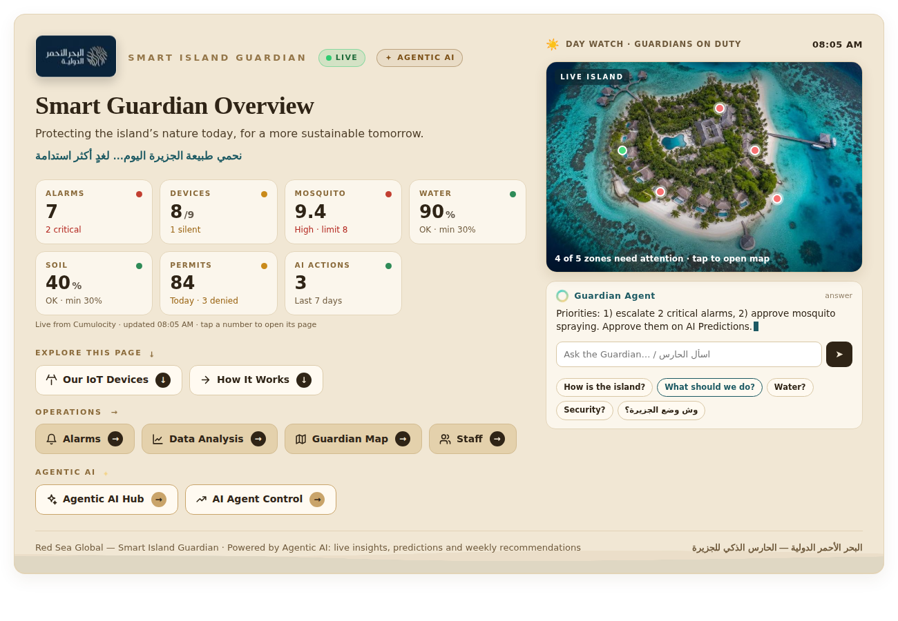
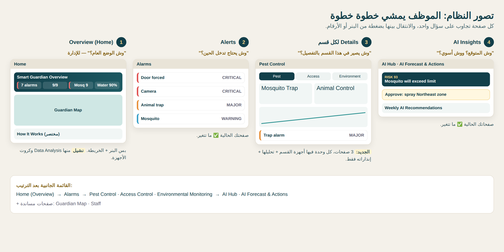
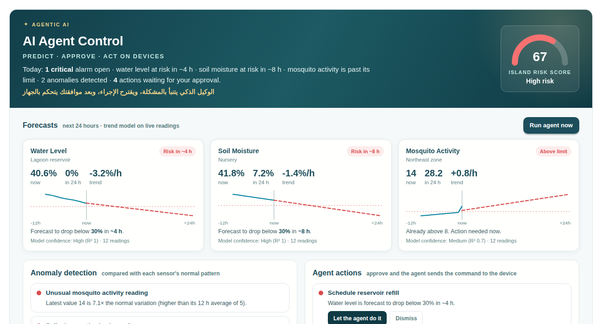

# Smart Island Guardian · الحارس الذكي للجزيرة

**IoT + Agentic AI dashboard on Cumulocity that protects an island’s nature, water and guests.**
Built for the *Cumulocity × Red Sea Global Agentic AI Bootcamp*.

> نحمي طبيعة الجزيرة اليوم… لغدٍ أكثر استدامة
> Protecting the island’s nature today, for a more sustainable tomorrow.



---

## The problem · المشكلة

An island resort faces three everyday risks:

| Risk | Example |
|---|---|
| 🦟 Pests near guest areas | Mosquitoes and animals around villas, gardens and storage |
| 💧 Water & soil | Reservoir running low, nursery soil drying out |
| 🔐 Restricted access | Forced doors, device tampering, forged permits |

Manual rounds find these problems **after** they happen.

## The solution · الحل

Nine IoT devices send live data to **Cumulocity IoT**. On top of it, an **Agentic AI layer** watches every sensor, predicts problems, proposes an action, and — after a human approves — **sends the command to the device**.

```
Sense → Predict → Detect → Recommend → Human approves → Command sent to device → Logged
```



## Features

| | Feature | Widget |
|---|---|---|
| 🏝️ | **Live home banner** – live KPIs, animated island map with zones that turn red on alarms, sky that follows the time of day, and an **“Ask the Guardian”** box | `01-home-banner.js` |
| 📟 | **Our IoT devices** – 9 devices in 3 areas, live status, opens each device in Device Management | `02-iot-devices.js` |
| 🔄 | **How it works** – signal-to-action flow with examples | `03-how-it-works.js` |
| 🚨 | **Alarms** – by severity and area, repeats grouped as one incident, acknowledge in one click | `04-alarms.js` |
| 📊 | **Data analysis** – 24 h / 7-day trends and access (permit) activity | `05-data-analysis.js` |
| 🤖 | **AI Agent Control** – 24 h forecast, anomaly detection, island risk score, approve → **device command via Cumulocity Operations** | `06-ai-agent-control.js` |
| 📅 | **Weekly AI recommendations** – incidents per area and ranked improvements | `07-weekly-ai-recommendations.js` |
| 💬 | **Ask the Guardian** – bilingual (EN/AR) assistant that answers from live data (v1, rule-based) | `08-ask-the-guardian.js` |
| 👥 | **Team page** – who guards which area | `09-team.js` |
| 🗺️ | **Guardian map** & **live AI insights** (Lit components) | `lit/` |



## How the AI works · آلية الذكاء الاصطناعي

All logic runs inside the dashboard (JavaScript) against the Cumulocity REST API — no external AI service, no data leaves the platform.

1. **Forecast** – least-squares linear regression on the last 12 h of each sensor; predicts when a reading will cross its limit (with R² as confidence).
2. **Anomaly detection** – z-score of the latest reading against the sensor’s own recent pattern; plus spike and night-time checks on denied permits.
3. **Recommendations & risk score** – rules turn forecasts, anomalies and open alarms into ranked actions and a 0–100 island risk score.
4. **Human in the loop** – a guardian clicks *Let the agent do it*. The agent then:
   - sends a `c8y_Command` **operation** to the device (e.g. `START_REFILL_PUMP`, `START_IRRIGATION 20`, `ACTIVATE_MISTING NE`),
   - logs a `c8y_AgentAction` event, and shows the command status (*pending → executed by device*).

| Method | Why |
|---|---|
| Linear regression | Simple, fast, explainable, runs in the browser |
| Z-score | Finds unusual readings relative to each sensor’s own normal |
| Rules + approval | Safe actions; people make the final decision |

## Devices

| Area | Device | Data |
|---|---|---|
| Security & Access | Permit reader (authorized / unauthorized), perimeter camera, door sensor, tamper sensor | events, alarms |
| Pest Control | Smart mosquito sensor, animal control trap | measurement `Mosquito.Activity`, trap events |
| Environmental | Water level sensor, soil moisture sensor | `WaterLevel.waterLevel`, `soilMoisture.moisture` |

Devices in the bootcamp were Cumulocity **device simulators**. See [`docs/SETUP.md`](docs/SETUP.md) for the simulator settings.

## Installation

1. In **Cockpit**, add an **HTML widget** → enable **Advanced developer mode** → **Web Component** tab → paste a file from `widgets/`.
2. Replace the placeholders (`WATER_LEVEL_DEVICE_ID`, `YOUR_GROUP_ID`, …) with your own IDs — see [`docs/SETUP.md`](docs/SETUP.md).
3. On each simulator that should receive agent commands, add the supported operation **`c8y_Command`**.

## Tech

Cumulocity IoT (Cockpit, Device Management, simulators, Operations, Smart Rules) · Vanilla JavaScript Web Components · Lit · REST API · SVG charts

## Roadmap

- Connect real sensors, pumps and misting systems
- Connect *Ask the Guardian* to a language model
- Stronger forecasting models once more real data is collected
- Move device IDs from code into a configuration file

## Author

**Bothynah Salem Alsnany** — platform, dashboards, custom widgets and AI agent layer.
Built with the *Island Guardians* team for the Cumulocity × Red Sea Global Agentic AI Bootcamp.

*Screenshots in this repository use sample data.*
